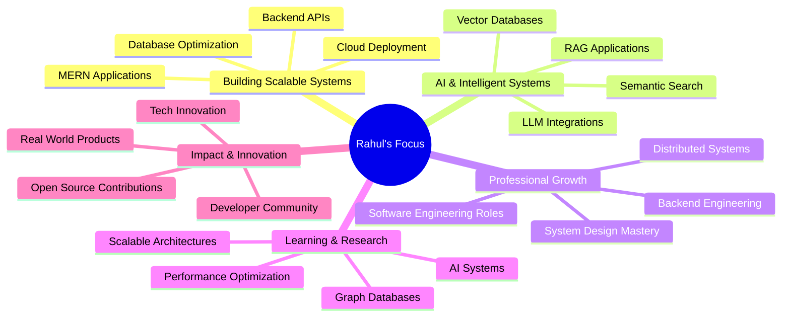

# 👋 Hey there, I'm Rahul Dhumal

---

🎓 **M.Sc. Computer Applications**
💻 **Full Stack Developer | AI Backend Engineer**
🚀 Passionate about **Backend Systems, AI Tools and Scalable Applications**

---

# 👨‍💻 About Me

I am a **Full Stack Developer focused on backend engineering and AI-powered systems**.

My work focuses on building **real-world software products** combining strong backend architecture, intelligent data systems, and scalable web applications.

💡 Areas I work in:

* Backend API Architecture
* MERN Stack Development
* AI / RAG Systems
* Database Design
* Scalable Web Platforms

---

# 🛠 Tech Arsenal

### 💻 Programming Languages

---

### 🌐 Frontend & Backend

---

### 🗄 Databases & Tools

---

# 🚀 Featured Projects

### 🏆 Building Software for Real-World Impact

<table>
<tr>

<td width="50%" valign="top">

### 🎟 EventBuzz  
**Event Ticket Booking Platform**

• Full-stack MERN ticket booking system  
• Admin dashboard for event management  
• Online & offline ticket booking  
• QR-based ticket verification  

**Impact**

📊 386+ tickets sold  
💰 ₹1.67L revenue managed  

**Tech Stack**

React • Node.js • Express • MongoDB

</td>

<td width="50%" valign="top">

### 🚗 Vehica  
**Smart Vehicle Recommendation System**

• MERN vehicle discovery platform  
• Smart search & filtering  
• Reviews and rating system  
• Admin vehicle management  

 

**Tech Stack**

React • Node.js • Express • MongoDB

</td>

</tr>

<tr>

<td width="50%" valign="top">

### 📄 Research Paper Navigator  
**AI RAG Research Explorer**

• Semantic search across research papers  
• Vector database powered search  
• Graph database relationships  
• Fast document ingestion pipeline  

 

**Tech Stack**

FastAPI • React • ChromaDB • Neo4j

</td>

<td width="50%" valign="top">

### 🍽 Smart Dine  
**AI QR Menu & Restaurant System**

• QR-based digital menu system  
• AI-powered menu assistant  
• Category-based food display  
• Restaurant admin panel  

 

**Tech Stack**

MERN Stack • AI Integration

</td>

</tr>
</table>

---

# 📊 GitHub Analytics

---

---

## 🐍 Contribution Snake

---

# 🎯 Current Mission & Goals

---

# 📫 Connect With Me

---

---

### ⭐ “Building real-world software that solves real problems.”

